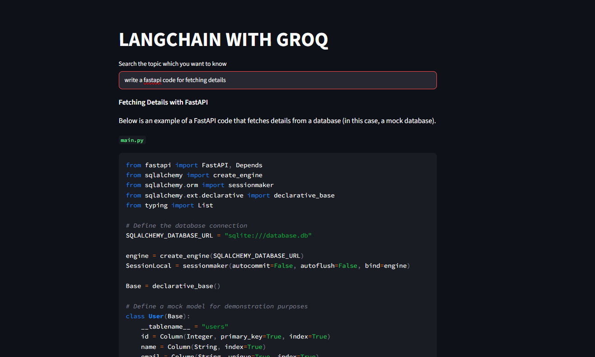
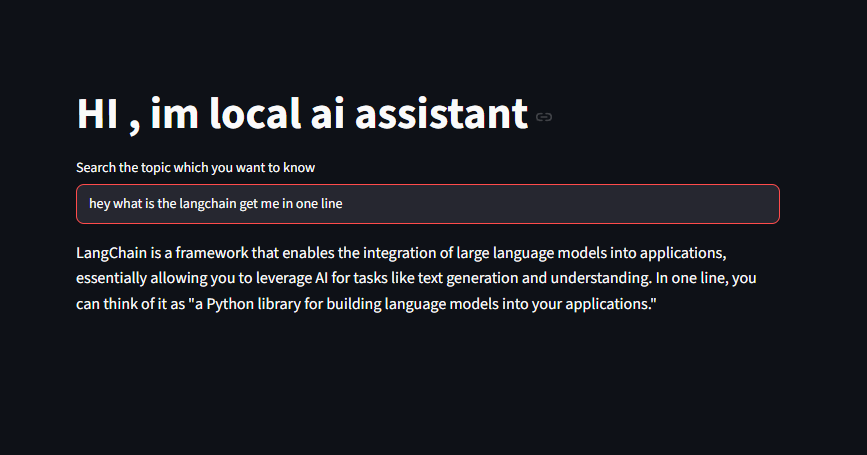

# 🤖 Multi-LLM ChatBot

A Streamlit-based AI ChatBot that supports multiple Large Language Models (LLMs). This project demonstrates how to build an interactive chatbot using LangChain with different providers such as Groq and local LLMs.

---

## ✨ Features

- 💬 Interactive chatbot built with Streamlit
- 🔗 LangChain Expression Language (LCEL)
- 🤖 Supports multiple LLM providers
  - Groq Cloud Models
  - Local LLMs
- 📝 Prompt Templates
- ⚡ Fast response generation
- 🔒 Environment variable support using `.env`

---

## 📂 Project Structure

```
ChatBot/
│
├── Bots/
│   ├── main.py          # Groq chatbot
│   └── localai.py       # Local LLM chatbot
│
├── outputs/
│   ├── groq.png
│   └── loacla.png
│
├── .env
├── req.txt
├── pyproject.toml
├── uv.lock
└── README.md
```

---

## 🛠️ Tech Stack

- Python
- Streamlit
- LangChain
- LangChain Core
- Groq API
- Local LLM
- uv
- dotenv

---

## 🚀 Installation

Clone the repository

```bash
git clone <repository-url>
```

Move into the project

```bash
cd ChatBot
```

Create a virtual environment

```bash
python -m venv .venv
```

Activate it

**Windows**

```bash
.venv\Scripts\activate
```

Install dependencies

```bash
pip install -r req.txt
```

or using uv

```bash
uv sync
```

---

## 🔑 Environment Variables

Create a `.env` file in the root directory.

Example:

```env
GROQ_API_KEY=your_api_key
```

---

## ▶️ Run the Application

### Groq ChatBot

```bash
uv run streamlit run Bots/main.py
```

### Local AI ChatBot

```bash
uv run streamlit run Bots/localai.py
```

---

## 📸 Outputs

### Groq ChatBot



---

### Local LLM ChatBot



---

## 📚 Concepts Used

- Prompt Engineering
- ChatPromptTemplate
- LangChain RunnableSequence
- LCEL (`|` Operator)
- StrOutputParser
- Streamlit UI
- Environment Variables
- LLM Integration

---

## 🎯 Future Improvements

- Conversation Memory
- Multiple Chat Sessions
- File Upload Support
- RAG Integration
- Tool Calling
- Agentic Workflows
- Chat History Persistence
- Model Selection from Sidebar

---

## 👨‍💻 Author

**Pramod B**

- GitHub: https://github.com/Pramod707
- LinkedIn: https://www.linkedin.com/in/pramod7/

---

## ⭐ If you found this project useful, consider giving it a star!